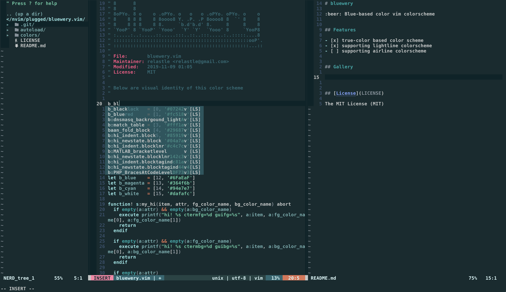

# bluewery.vim

:beer: Blue-based color vim colorscheme

## Features

- [x] true-color based color scheme
- [x] supporting lightline colorscheme
- [ ] supporting airline colorscheme

## Gallery

| Mode | Status line image |
| ---  | ---               |
| NORMAL|  |
| INSERT|  |
| VISUAL|  |
| REPLACE|  |

## pallete

<!-- Autogenerated-pallete start -->
|color_name      |color_code|color                                                      |color_name      |color_code|color                                                      |
|---             |---       |---                                                        |---             |---       |---                                                        |
|black (normal)  |`#072429` ||black (bright)  |`#142c30` ||
|red (normal)    |`#fc5185` ||red (bright)    |`#fc81a5` ||
|yellow (normal) |`#5AC6A1` ||yellow (bright) |`#234444` ||
|green (normal)  |`#fff1ac` ||green (bright)  |`#DF7353` ||
|blue (normal)   |`#296873` ||blue (bright)   |`#6FaEaF` ||
|magenta (normal)|`#85919b` ||magenta (bright)|`#364f6b` ||
|cyan (normal)   |`#04a7a7` ||cyan (bright)   |`#94e7e7` ||
|white (normal)  |`#c4c7c7` ||white (bright)  |`#dafafc` ||
<!-- Autogenerated-pallete end -->

## Thanks

This colorscheme is inspired by 

- [iceberg](https://github.com/cocopon/iceberg.vim/)
- [gotham](https://github.com/whatyouhide/vim-gotham)
- [solarized](https://github.com/altercation/vim-colors-solarized)

## [License](LICENSE)

The MIT License (MIT)
