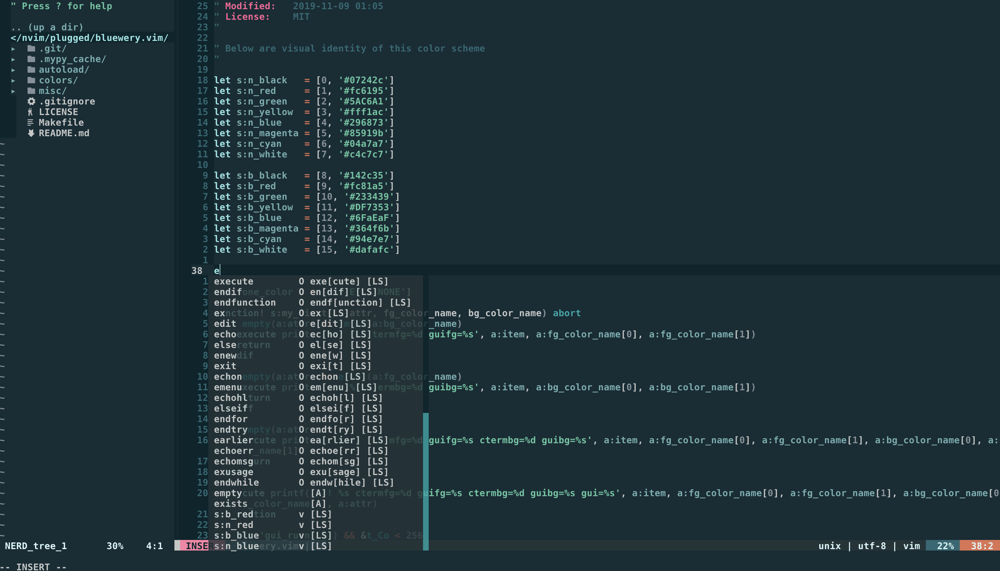
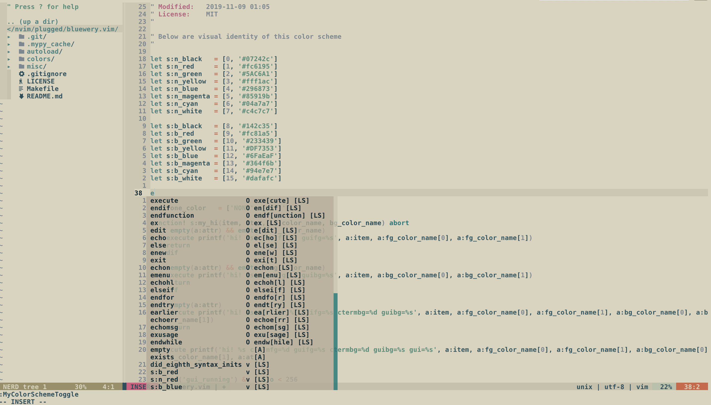

# bluewery.vim

:large_blue_diamond: Blue-based vim colorscheme :beer:

## bluewery



| Mode    | Status line image                                |
| ---     | ---                                              |
| NORMAL  |    |
| INSERT  |    |
| VISUAL  |    |
| REPLACE |  |

## bluewery-light



| Mode    | Status line image                                 |
| ---     | ---                                               |
| NORMAL  |    |
| INSERT  |    |
| VISUAL  |    |
| REPLACE |  |


## Installation

Using [vim-plug](https://github.com/junegunn/vim-plug),

```vim
Plug 'relastle/bluewery.vim'
```

Add following lines into your `.vimrc`.

```vim
" For dark
colorscheme bluewery
let g:lightline = { 'colorscheme': 'bluewery' }

" For light
colorscheme bluewery-light
let g:lightline = { 'colorscheme': 'bluewery_light' }
```

## Features

- [x] True-color based color scheme.
- [x] Supporting lightline colorscheme.
- [x] `Dark` and `Light` version schemes.
- [ ] Supporting airline colorscheme.

## pallete

This color scheme is created for `truecolor` environment,
but you can use it in non-truecolor environment by configuring
you terminal as following color pallete.

### Dark

<!-- Autogenerated-pallete start dark -->
|color_name      |color_code|color                                                      |color_name      |color_code|color                                                      |
|---             |---       |---                                                        |---             |---       |---                                                        |
|black (normal)  |`#07242c` ||black (bright)  |`#142c35` ||
|red (normal)    |`#fc6195` ||red (bright)    |`#fc81a5` ||
|green (normal)  |`#5AC6A1` ||green (bright)  |`#233439` ||
|yellow (normal) |`#fff1ac` ||yellow (bright) |`#DF7353` ||
|blue (normal)   |`#296873` ||blue (bright)   |`#6FaEaF` ||
|magenta (normal)|`#85919b` ||magenta (bright)|`#364f6b` ||
|cyan (normal)   |`#04a7a7` ||cyan (bright)   |`#94e7e7` ||
|white (normal)  |`#c4c7c7` ||white (bright)  |`#dafafc` ||
<!-- Autogenerated-pallete end dark -->

### Light

<!-- Autogenerated-pallete start light -->
|color_name      |color_code|color                                                      |color_name      |color_code|color                                                      |
|---             |---       |---                                                        |---             |---       |---                                                        |
|black (normal)  |`#07242c` ||black (bright)  |`#234f5c` ||
|red (normal)    |`#bb627d` ||red (bright)    |`#d65b7f` ||
|green (normal)  |`#4c8d77` ||green (bright)  |`#b5ab95` ||
|yellow (normal) |`#978f65` ||yellow (bright) |`#d16545` ||
|blue (normal)   |`#2b5860` ||blue (bright)   |`#428182` ||
|magenta (normal)|`#7b8791` ||magenta (bright)|`#c7c1aa` ||
|cyan (normal)   |`#007777` ||cyan (bright)   |`#b7c1aa` ||
|white (normal)  |`#cdc7b0` ||white (bright)  |`#dad4bd` ||
<!-- Autogenerated-pallete end light -->

## Thanks

This colorscheme is inspired by

- [iceberg](https://github.com/cocopon/iceberg.vim/)
- [gotham](https://github.com/whatyouhide/vim-gotham)
- [solarized](https://github.com/altercation/vim-colors-solarized)

## [License](LICENSE)

The MIT License (MIT)
